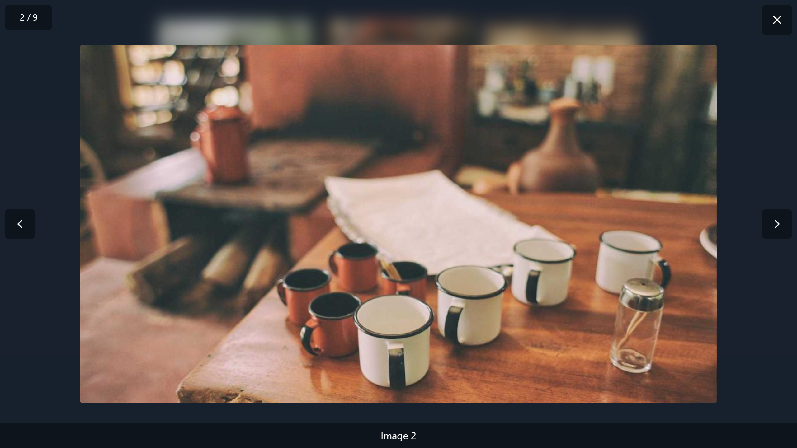

# Vue3 Simple Lightbox

<p align="left">
  <a href="https://www.typescriptlang.org/"></a>
  <a href="https://www.npmjs.com/package/vue3-simple-lightbox"></a>
    <a href="https://www.npmjs.com/package/vue3-simple-lightbox"></a>
  <a href="https://github.com/tobiaswaelde/vue3-simple-lightbox/actions/workflows/test-build.yml"></a>
  <a href="https://github.com/tobiaswaelde/vue3-simple-lightbox/actions/workflows/npm-publish.yml"></a>
</p>


A simple lightbox component for [Vue](https://vuejs.org/).

<p align="center">
  
  <caption>Preview with caption & custom icons</caption>
</p>

## 📚 Table of Contents <!-- omit in toc -->

- [✨ Features](#-features)
- [📦 Installation](#-installation)
- [🚀 Basic Usage](#-basic-usage)
- [⚙️ Props](#️-props)
- [🎯 Slots](#-slots)
- [🎨 Theming](#-theming)

## ✨ Features

- 🖼️ Simple, customizable lightbox
- 💅 Tailwind-friendly styling with full theming support
- 🧩 Component-based API with custom slots
- 🪶 Lightweight with almost zero dependencies
- 📦 Works with Vite, Nuxt, and other modern Vue setups

## 📦 Installation
#### Install using yarn
```sh
yarn add vue3-simple-lightbox
```

#### Install using NPM
```sh
npm install vue3-simple-lightbox
```

## 🚀 Basic Usage
```vue
<template>
  <!-- shows a preview grid of the images. The clicked image will be opened in the lightbox. -->
  <main class="flex flex-col items-center py-8">
    <div class="max-w-3xl grid grid-cols-3 gap-4">
      <button v-for="(item, index) in items" :key="item.id" @click="handleOpen(index)" class="cursor-pointer">
        
      </button>
    </div>
  </main>

  <!-- Lightbox with custom icons -->
  <Lightbox :items="items" v-model:open="open" v-model:index="index">
    <template #closeIcon>
      <IconX class="size-6" />
    </template>
    <template #prevIcon>
      <IconChevronLeft class="size-6" />
    </template>
    <template #nextIcon>
      <IconChevronRight class="size-6" />
    </template>
  </Lightbox>
</template>

<script setup lang="ts">
import { ref } from 'vue';
import { IconChevronLeft, IconChevronRight, IconX } from '@tabler/icons-vue';

import { Lightbox, type LightboxItem } from 'vue3-simple-lightbox';
import 'vue3-simple-lightbox/vue3-simple-lightbox.css';

type Item = LightboxItem & { id: string; src: string };

// defines an array of random images
const items = ref<Item[]>([
  { id: crypto.randomUUID(), src: `https://picsum.photos/seed/${crypto.randomUUID()}/1280/720` },
  { id: crypto.randomUUID(), src: `https://picsum.photos/seed/${crypto.randomUUID()}/1280/720`, caption: 'Image 2' },
  { id: crypto.randomUUID(), src: `https://picsum.photos/seed/${crypto.randomUUID()}/1280/720` },
  { id: crypto.randomUUID(), src: `https://picsum.photos/seed/${crypto.randomUUID()}/1280/720` },
  { id: crypto.randomUUID(), src: `https://picsum.photos/seed/${crypto.randomUUID()}/1280/720` },
  { id: crypto.randomUUID(), src: `https://picsum.photos/seed/${crypto.randomUUID()}/1280/720` },
  { id: crypto.randomUUID(), src: `https://picsum.photos/seed/${crypto.randomUUID()}/1280/720` },
  { id: crypto.randomUUID(), src: `https://picsum.photos/seed/${crypto.randomUUID()}/1280/720` },
  { id: crypto.randomUUID(), src: `https://picsum.photos/seed/${crypto.randomUUID()}/1280/720` },
]);

// the index of the current image
const index = ref<number>(0);
// the state of the lightbox
const open = ref<boolean>(false);

// opens the clicked image
const handleOpen = (value: number) => {
  index.value = value;
  open.value = true;
};
</script>
```


## ⚙️ Props

| Prop    | Type              | Description             |
| ------- | ----------------- | ----------------------- |
| `ui`    | `LightboxUiProps` | see [Theming](#theming) |
| `items` | `LightboxItem[]`  | The items to display.   |

#### LightboxItem
You can define items in two different ways:

1. Provide only the image URL as string
```vue
<Lightbox 
  :items="[
    'https://picsum.photos/1280/720',
    'https://picsum.photos/1280/720',
    'https://picsum.photos/1280/720',
  ]"
/>
```

2. Provide an object with optional caption & alt text
```vue
<Lightbox 
  :items="[
    { src: 'https://picsum.photos/1280/720', alt: 'image 1', caption: 'Image Caption 1' },
    { src: 'https://picsum.photos/1280/720', alt: 'image 2', caption: 'Image Caption 2' },
    { src: 'https://picsum.photos/1280/720', alt: 'image 3', caption: 'Image Caption 3' },
  ]"
/>
```

## 🎯 Slots

| Slot        | Type                                                |
| ----------- | --------------------------------------------------- |
| `index`     | `{ current: number; total: number; text: string; }` |
| `close`     | `{ click: () => void; }`                            |
| `closeIcon` | `{  }`                                              |
| `prev`      | `{ visible: boolean; click: () => void; }`          |
| `prevIcon`  | `{  }`                                              |
| `next`      | `{ visible: boolean; click: () => void; }`          |
| `nextIcon`  | `{  }`                                              |
| `caption`   | `{ text: string; }`                                 |
| `item`      | `{ item: LightboxItem; index: number; }`            |

## 🎨 Theming

```ts
const defaultUi: LightboxUiProps = {
  backdrop: 'fixed inset-0 z-50 flex items-center justify-center bg-black/20 backdrop-blur-md select-none',
  content: {
    wrapper: 'relative size-full z-40 overscroll-none',
    base: 'absolute inset-0 text-white flex flex-row items-center',
  },
  images: {
    wrapper: 'flex items-center overflow-x-auto snap-x snap-mandatory scroll-smooth w-full px-1 sm:px-4 lg:px-16 !cursor-default',
    item: 'flex-shrink-0 size-full flex items-center justify-center snap-center mx-1 sm:mx-4 lg:mx-16',
    img: 'max-h-[80vh] max-w-full object-contain rounded-md',
  },
  caption: {
    wrapper: 'absolute bottom-0 left-0 w-full',
    text: 'text-center bg-black/40 text-white px-4 py-2',
  },
  index: {
    wrapper: 'absolute top-2 left-2',
    base: 'flex flex-row items-center bg-black/40 text-white px-6 py-3 rounded-md',
    text: 'text-sm leading-4',
  },
  close: {
    wrapper: 'absolute top-2 right-2',
    base: 'bg-black/40 hover:bg-black/60 active:bg-black/80 text-white size-8 sm:size-10 lg:size-12 flex items-center justify-center rounded-md cursor-pointer transition-all duration-150',
    icon: 'size-6',
  },
  prev: {
    wrapper: 'absolute top-1/2 -translate-y-1/2 left-2',
    base: 'bg-black/40 hover:bg-black/60 active:bg-black/80 text-white size-8 sm:size-10 lg:size-12 flex items-center justify-center rounded-md cursor-pointer transition-all duration-150',
    icon: 'size-6',
  },
  next: {
    wrapper: 'absolute top-1/2 -translate-y-1/2 right-2',
    base: 'bg-black/40 hover:bg-black/60 active:bg-black/80 text-white size-8 sm:size-10 lg:size-12 flex items-center justify-center rounded-md cursor-pointer transition-all duration-150',
    icon: 'size-6',
  },
}
```

## 🤝 Contributing <!-- omit in toc -->

Contributions, issues, and feature requests are welcome!  
Feel free to check [issues](https://github.com/tobiaswaelde/vue3-simple-lightbox/issues) and open a pull request.

1. Fork the repo
2. Create your feature branch (`git checkout -b feat/something`)
3. Commit your changes
4. Push to the branch
5. Open a PR

## 📝 License <!-- omit in toc -->

MIT © [Tobias Wälde](https://github.com/tobiaswaelde)